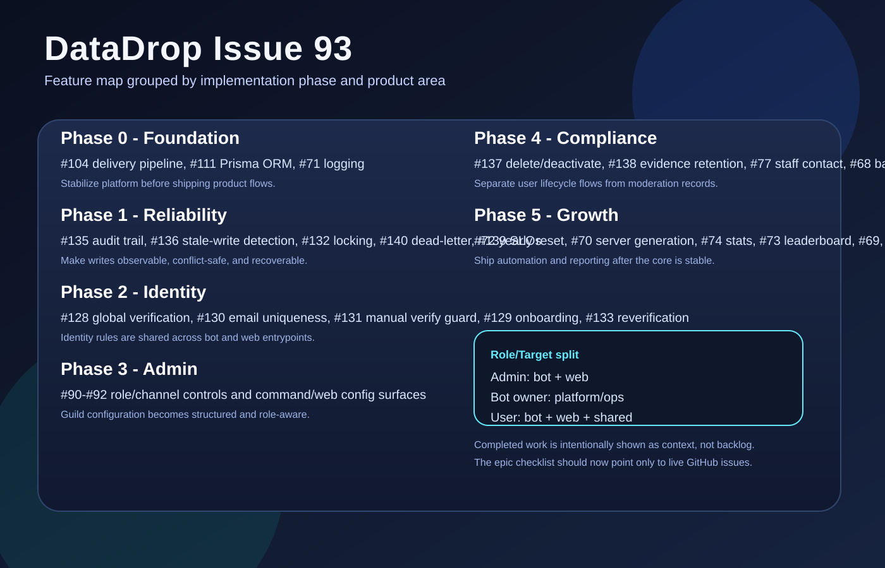
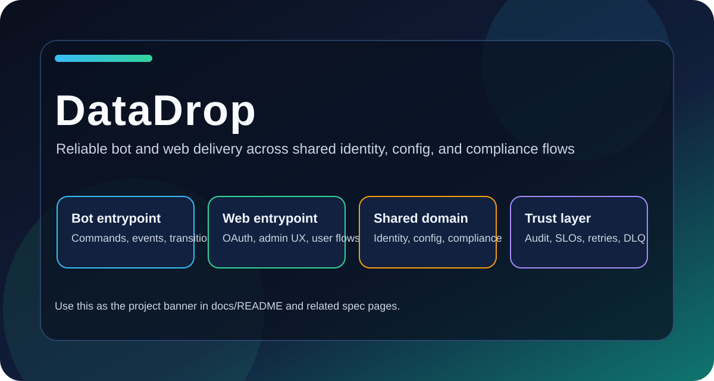

# DataDrop Documentation

This folder is the project knowledge base for Issue 93 and related implementation work.

## What is in here

- [Issue 93 Specification](specs/issue-93-specification.md)
- [Architecture](specs/architecture.md)
- [Membership State Machine](specs/state-machine.md)
- [BPMN-Style Lifecycle](specs/bpmn-lifecycle.md)
- [MVP Scope](specs/mvp-scope.md)
- [Discord API and Discord.js Sources](specs/discord-sources.md)
- [GitHub Sources](specs/github-sources.md)
- [Strict Traceability Matrix](specs/traceability-matrix.md)
- [Roadmap Beyond MVP](specs/non-mvp-roadmap.md)

## Visual Assets

- Feature list snapshot: 
- Project visual marker: 

## Notes

- Mermaid diagrams are embedded directly in markdown files.
- Any statement tied to Discord API or Discord.js behavior is sourced in [Discord API and Discord.js Sources](specs/discord-sources.md).
