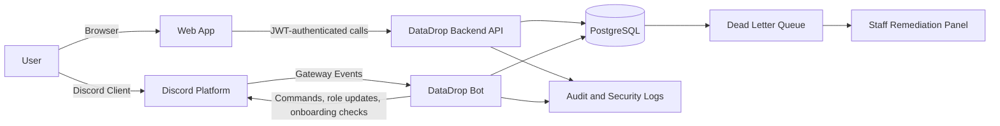
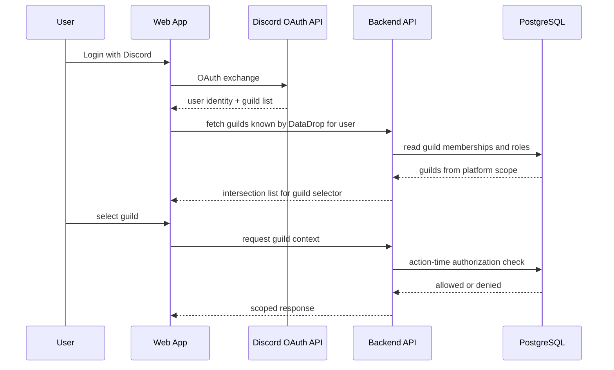

# Architecture

## Context

DataDrop has two behavior entrypoints:

1. Discord Bot runtime
2. Web App + Backend API

Both must enforce the same business rules and write to the same domain model.

## High-Level System Diagram

## Tenant and Access Flow

## Cross-Entrypoint Consistency

Design rule:

- Bot and API writes use strict optimistic locking
- Transition preconditions include expected state and expected version
- Conflict retries are bounded
- Retry exhaustion creates dead-letter records

## Source Notes

For Discord gateway and member update semantics, see [Discord API and Discord.js Sources](discord-sources.md).
