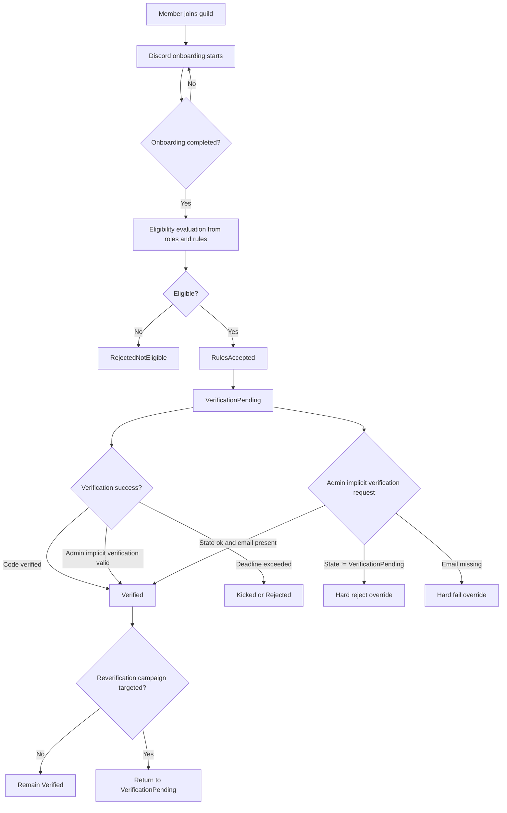

# BPMN-Style Lifecycle Flow

This document captures the intended operational flow for onboarding, eligibility, rules acceptance, verification, and admin override handling.

## Flow Diagram

## Rule Highlights

1. Rules acceptance remains per guild because onboarding is a guild-bound Discord flow.
2. Global verification identity does not bypass guild onboarding acceptance.
3. Manual implicit verification is constrained to `VerificationPending` and requires email presence.
4. Historical override does not provide permanent bypass entitlement in future campaigns.

## Discord-Specific Notes

1. Member updates are observed through gateway member update events.
2. Onboarding and member flags are platform-defined by Discord.
3. Membership screening and pending semantics are Discord-defined.

Reference all platform-specific semantics through [Discord API and Discord.js Sources](discord-sources.md).
