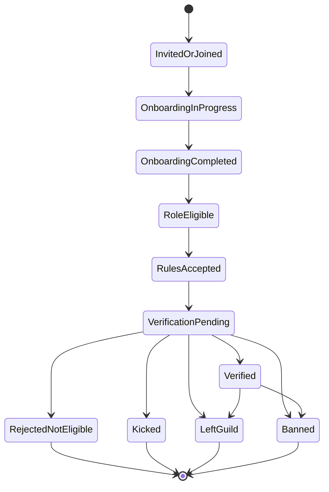
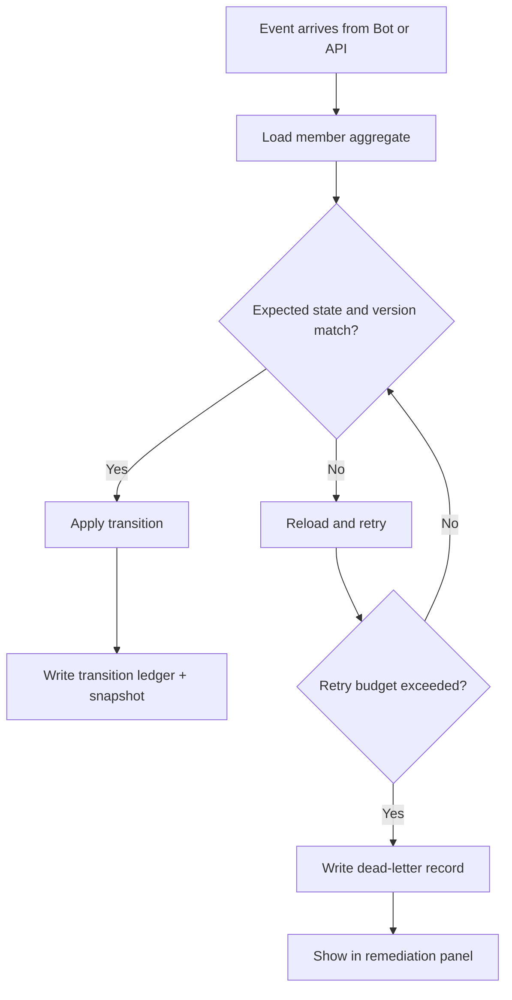

# Membership State Machine

## Canonical Lifecycle

## Critical Guard Rules

1. Admin implicit verification transition is valid only from `VerificationPending`.
2. Admin implicit verification must hard fail if email is missing.
3. Successful manual implicit verification transition is only `VerificationPending -> Verified`.
4. Historical manual override does not grant bypass in future reverification waves.
5. Per-guild onboarding and rules acceptance remain mandatory even when user is globally verified.

## Transition Control

Every transition must include:

1. Expected current state
2. Expected aggregate version
3. Idempotency key
4. Transition source
5. Reason code

## Reconciliation Model

## Notes on Discord Signals

- `GUILD_MEMBER_UPDATE` is treated as an input signal, not sole source of truth.
- Role and flag deltas can trigger reconciliation runs.
- No assumption is made that onboarding reruns always produce unique onboarding-specific flags changes.

## Source Notes

For member update events, pending behavior, and member flags, see [Discord API and Discord.js Sources](discord-sources.md).
